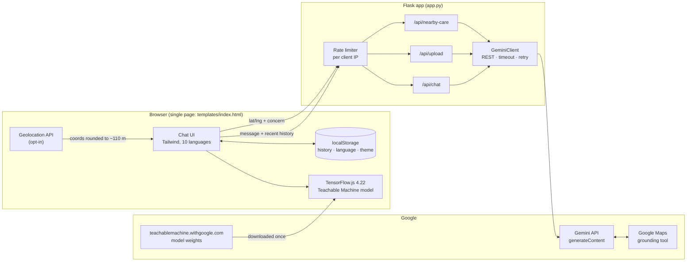
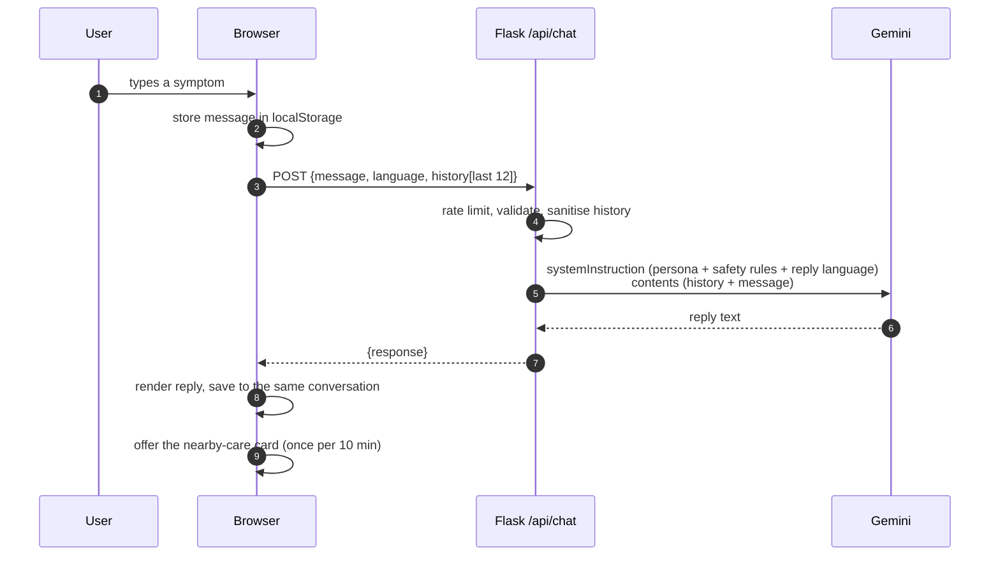
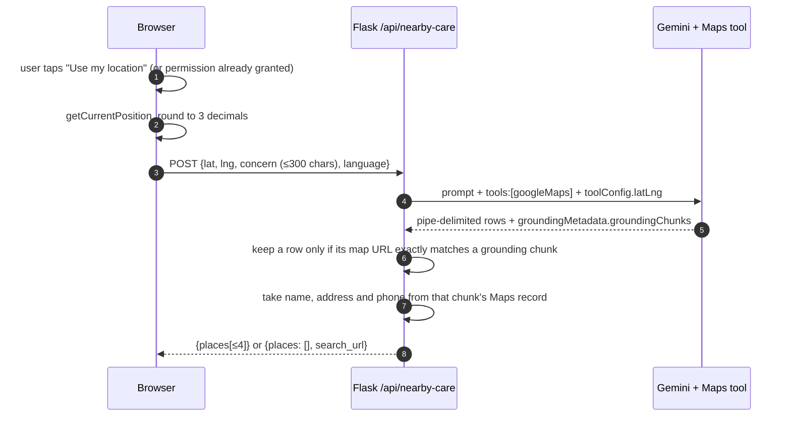

<div align="center">

# AarogyaLink

**A multilingual AI health companion for India: symptom guidance in ten languages, on-device skin checks, and nearby care grounded in Google Maps.**

[](https://github.com/ScholarlyAdeeb/AarogyaLink/actions/workflows/ci.yml)


</div>

> [!IMPORTANT]
> AarogyaLink gives general health information. It is **not a medical device**, does not diagnose, and is not a substitute for a doctor. In an emergency call **112**.

---

## Contents

- [Overview](#overview)
- [Features](#features)
- [Architecture](#architecture)
- [How each feature works](#how-each-feature-works)
- [Privacy and data flow](#privacy-and-data-flow)
- [Security](#security)
- [API reference](#api-reference)
- [Getting started](#getting-started)
- [Configuration](#configuration)
- [Testing](#testing)
- [Deployment](#deployment)
- [Project structure](#project-structure)
- [Known limitations](#known-limitations)
- [Roadmap](#roadmap)
- [Contributing](#contributing)
- [License](#license)

## Overview

Many people in India first look up a symptom in a language other than English, on a low-end phone, often on a slow connection. AarogyaLink is built for that situation:

- **Ten languages**, for both the interface and the AI's replies: English, Hindi, Tamil, Bengali, Telugu, Marathi, Kannada, Gujarati, Punjabi and Malayalam.
- **No account, no install.** It is a single web page. Conversation history is kept in the browser, not on a server.
- **Skin photos stay on the phone.** A TensorFlow.js model classifies them in the browser.
- **Care that actually exists nearby.** Clinic suggestions come from Google Maps grounding. Every name, address and phone number is checked against the Maps record before it is shown.

Built for Smart India Hackathon (SIH).

## Features

| Feature | What it does | Where it runs |
|---|---|---|
| **Symptom chat** | Short, friendly guidance in 2–4 sentences: a brief assessment, self-care steps and when to see a doctor. Keeps context across follow-up questions. | Flask → Google Gemini |
| **Emergency safety net** | Emergency symptoms such as chest pain, stroke signs or trouble breathing get an immediate "call 112" before anything else. The rule is in the system instruction, so a user message cannot override it. | Gemini system instruction |
| **On-device skin check** | Classifies a photo into 10 classes (8 skin infections, `HEALTHY`, `INVALID IMAGE`) and shows the top 3 with probabilities. | Browser (TensorFlow.js) |
| **Nearby care** | Up to 4 nearby clinics or hospitals, picked to fit the concern, with call and map links. Opt-in: the location is used only after the user agrees. | Flask → Gemini with Google Maps grounding |
| **Image / voice-note analysis API** | `POST /api/upload` accepts a photo or an audio note for Gemini to analyse. The bundled UI does not use it yet. | Flask → Gemini |
| **Local history** | Several conversations with search, delete and clear-all, plus a dark mode. | Browser `localStorage` |

## Architecture



**Design choices**

- **One Flask process, no database.** The server keeps no state apart from rate-limit counters, and conversation history lives in the user's browser. That keeps hosting cheap and means there is no stored health data to leak.
- **Gemini over plain REST, not an SDK.** All three AI routes share one small client (`GeminiClient`) with the same timeouts, retry on 429/5xx, error mapping and safety handling. It replaced the deprecated `google-generativeai` SDK, which had no timeout at all.
- **Skin inference in the browser.** Photos never need to be uploaded, the server needs no GPU, and the check keeps working once the model is cached.
- **Safety rules live in `systemInstruction`.** User text goes into `contents` as a user turn and is never pasted into the prompt, so it cannot rewrite the rules.

## How each feature works

### Symptom chat



- **Prompts.** Each language has a persona prompt written in that language (`HEALTH_CONTEXTS`), followed by one shared set of English safety rules (`SAFETY_RULES`) and an explicit "Always reply in <language>".
- **History.** The browser sends the last 12 turns. The server treats them as untrusted: it keeps only well-formed `user`/`ai` turns, caps each at 2,000 characters and the total at 12,000, and makes sure the conversation starts with a user turn.
- **Failures.** A Gemini 429/503 comes back as **503 "busy, try again in a minute"**. Any other upstream error comes back as **502**. The UI shows a retry card, and retrying does not duplicate the question.

### On-device skin check

1. The user takes or picks a photo. It becomes an object URL in the browser and is never uploaded.
2. The Teachable Machine model is downloaded during boot and cached by the browser. If the download fails, the next scan tries again.
3. `model.predict()` runs in TensorFlow.js. The top class, its confidence and the top 3 bars are shown.
4. "Ask about this in chat" sends only the predicted label and its confidence as a chat message, never the photo.

Model classes: cellulitis, impetigo, athlete's foot, nail fungus, ringworm, cutaneous larva migrans, chickenpox, shingles, `HEALTHY`, `INVALID IMAGE`.

### Nearby care (grounded)



The model chooses and orders the places. Everything the user sees is copied from the grounding record Google Maps returned:

- A row is shown only if its Maps link **exactly** matches a link Google returned. A place the model invents has no such link, so it is dropped.
- Name and address come from the Maps record, not from the model's text.
- A phone number is shown only if it appears in that place's Maps record. A number the model makes up is dropped (there is a test for this).
- If nothing usable comes back, the UI offers a plain Google Maps search instead.

## Privacy and data flow

| Data | Where it goes | Kept where, for how long |
|---|---|---|
| Chat messages and recent history | Your server → Google Gemini | Browser `localStorage` until the user deletes it. The server stores nothing and does not log message text. |
| Skin photos | **Nowhere.** Classified in the browser. | Only in memory while the result screen is open |
| Skin prediction label | Sent only if the user taps "Ask about this in chat" | As part of that conversation |
| Location | Only after opt-in, rounded to ~110 m → your server → Gemini/Maps | Rounded position cached in `localStorage` for up to 7 days; erased if the user denies permission |
| Uploads to `/api/upload` | Your server → Gemini. Images are re-encoded, which strips EXIF data including GPS. | Processed in memory and never written to disk |

The UI says the same in every language: chat goes to Google Gemini, history stays in the browser, and skin photos stay on the device. Under Gemini API terms, Google may use data sent on the free tier to improve its products. Use a paid tier for real deployments that handle health information.

## Security

| Control | Implementation |
|---|---|
| Prompt injection | Rules in `systemInstruction`; user text only in `contents`; the model is told to treat user text as data |
| Rate limiting | 20 requests per client per minute on the AI routes (`RATE_LIMIT_PER_MINUTE`); thread-safe, idle entries pruned |
| Real client IPs behind a proxy | `ProxyFix`, enabled with `TRUST_PROXY_HOPS` |
| CORS | **Off by default**, because the UI is same-origin. Enable per origin with `ALLOWED_ORIGINS`. |
| Headers | CSP, `X-Frame-Options: DENY`, `nosniff`, `Referrer-Policy`, `Permissions-Policy`, `Cache-Control: no-store` on the API |
| Input limits | Message 2,000 chars · concern 300 · body 16 MB · audio 14 MB · images 25 MP (decompression-bomb guard) |
| Uploads | Never written to disk; images are checked with Pillow and re-encoded; audio limited to formats Gemini supports |
| Secrets | `GEMINI_API_KEY` read from the environment and sent as a header, never in a URL; `.env` is git-ignored |
| Debug surfaces | `/debug` returns 404 unless `ENABLE_DEBUG_PAGE=1`; the Werkzeug debugger is off unless `FLASK_DEBUG=1`; binds to `127.0.0.1` by default |
| XSS | Model output is escaped before the small amount of markdown formatting is applied; untrusted text is inserted with `textContent` |

## API reference

All endpoints return JSON. Errors look like `{"error": "<message>"}`.

### `GET /health`

```json
{ "status": "ok", "ai_configured": true, "timestamp": "2026-10-03T04:30:00+00:00" }
```

### `POST /api/chat`

| Field | Type | Notes |
|---|---|---|
| `message` | string, required | 1–2,000 characters |
| `language` | string | One of `en hi ta bn te mr kn gu pa ml`; anything else falls back to `en` |
| `history` | array | `[{ "role": "user" \| "ai", "content": "..." }]`, oldest first; the server keeps the last 12 |

```bash
curl -s localhost:5000/api/chat -H "Content-Type: application/json" \
  -d '{"message":"I have a mild fever since yesterday","language":"hi"}'
```

```json
{ "success": true, "response": "…", "source": "gemini", "language": "hi", "timestamp": "…" }
```

### `POST /api/upload` (multipart/form-data)

| Field | Notes |
|---|---|
| `file` | Image (`png jpg jpeg gif bmp tiff webp`) or audio (`wav mp3 aac ogg flac aiff`) |
| `description` | Optional, up to 500 characters |
| `language` | As for chat |
| `ai_predictions` | Optional JSON of on-device predictions, given to the model as an unverified hint |

### `POST /api/nearby-care`

| Field | Type | Notes |
|---|---|---|
| `lat`, `lng` | number, required | Rounded to 3 decimals on the server |
| `concern` | string | Truncated to 300 characters |
| `language` | string | Specialty labels come back in this language |

```json
{
  "success": true,
  "places": [{
    "name": "K.C. General Hospital",
    "specialty": "General physician",
    "address": "Malleswaram Circle, Police Station Rd, Bengaluru, Karnataka 560003, India",
    "phone": "+91 80 2334 1771",
    "maps_url": "https://maps.google.com/maps?cid=15660480208551984603"
  }],
  "latitude": 12.972, "longitude": 77.595, "source": "google_maps"
}
```

### Status codes

| Code | Meaning |
|---|---|
| 400 | Invalid input |
| 413 | Body larger than 16 MB, or audio larger than 14 MB |
| 429 | This client exceeded its per-minute limit |
| 502 | Gemini returned an unusable answer |
| 503 | `GEMINI_API_KEY` not set, or Gemini is out of quota or overloaded |

## Getting started

**Prerequisites:** Python 3.11+ and a [Google AI Studio API key](https://aistudio.google.com/apikey).

```bash
git clone https://github.com/ScholarlyAdeeb/AarogyaLink.git
cd AarogyaLink
python -m venv .venv
source .venv/bin/activate        # Windows: .venv\Scripts\activate
pip install -r requirements.txt
cp .env.example .env             # then set GEMINI_API_KEY
python app.py
```

Open <http://127.0.0.1:5000>. Add `?boot` to the URL to replay the start-up screen.

## Configuration

All settings are environment variables. `.env` is loaded automatically; see [`.env.example`](.env.example).

| Variable | Default | Purpose |
|---|---|---|
| `GEMINI_API_KEY` | *(required)* | Google AI Studio key. Without it the AI routes return 503. |
| `GEMINI_MODEL` | `gemini-3.5-flash-lite` | Model used by every route. It must support the `googleMaps` tool for nearby care. |
| `RATE_LIMIT_PER_MINUTE` | `20` | Per-client limit on the AI routes |
| `TRUST_PROXY_HOPS` | `0` | Set to `1` behind Heroku, Render or nginx |
| `ALLOWED_ORIGINS` | *(empty)* | Comma-separated origins allowed to call `/api/*` cross-origin |
| `ENABLE_DEBUG_PAGE` | `0` | Serve the `/debug` model diagnostics page |
| `HOST` / `PORT` | `127.0.0.1` / `5000` | Bind address for `python app.py` |
| `FLASK_DEBUG` | `0` | Werkzeug debugger. Never enable it in production. |
| `LOG_LEVEL` | `INFO` | Python log level |

> [!NOTE]
> Free-tier Gemini keys have small daily quotas per model (for example 20 requests a day for `gemini-2.5-flash` when this was written). When the quota runs out, users see "The AI service is busy". Check [your limits](https://ai.dev/rate-limit) before a demo, and enable billing for real use.

## Testing

```bash
pip install -r requirements-dev.txt
python -m pytest -q
```

The suite (41 tests) replaces Gemini with a fake client, so it never touches the network or your quota. It covers:

- input validation and language fallback
- history sanitising and size caps
- rate limiting
- error mapping (502 vs 503)
- CORS defaults and security headers
- image re-encoding and inline audio
- the grounding checks: invented places and phone numbers are dropped, name and address come from the Maps record, coordinates are rounded

GitHub Actions runs it on Python 3.11, 3.12 and 3.13 for every push and pull request.

## Deployment

The included `Procfile` works on Heroku, Render, Railway and similar platforms:

```
web: gunicorn app:app --workers 1 --threads 8 --timeout 90 --bind 0.0.0.0:$PORT
```

- **One process with 8 threads.** The AI calls are I/O-bound, and a single process keeps the in-memory rate limiter accurate.
- **`--timeout 90`** is longer than the worst case for a Gemini call (a 30 s read, retried once).
- Set `GEMINI_API_KEY` and `TRUST_PROXY_HOPS=1` on the platform.
- Serve over **HTTPS**. Browsers allow camera capture and geolocation only on secure origins (or `localhost`).

### Vercel

Vercel detects the Flask `app` in `app.py` automatically. [`vercel.json`](vercel.json) only raises the function timeout to 90 s (longer than a Gemini call plus its retry) and keeps tests and design files out of the bundle.

1. Import the repository in Vercel. No build command is needed.
2. Under **Settings → Environment Variables**, add `GEMINI_API_KEY` and `TRUST_PROXY_HOPS=1`. `.env` is not deployed.
3. Deploy. Vercel serves over HTTPS, so camera capture and location work.

> [!NOTE]
> On Vercel each function instance keeps its own rate-limit counters, so `RATE_LIMIT_PER_MINUTE` is a best-effort limit there. Use a shared store such as Upstash Redis if you need a strict one.

## Project structure

```
AarogyaLink/
├── app.py                  # Flask app: config, security, Gemini client, prompts, routes
├── templates/
│   ├── index.html          # the whole single-page UI: markup, i18n strings, app logic
│   └── debug.html          # model diagnostics page (ENABLE_DEBUG_PAGE=1)
├── tests/
│   ├── conftest.py         # forces an empty API key so tests stay offline
│   └── test_app.py         # 41 tests against a fake Gemini client
├── .github/workflows/ci.yml
├── requirements.txt        # 7 runtime dependencies
├── requirements-dev.txt    # + pytest
├── Procfile                # gunicorn entry point
├── .env.example            # every setting, documented
└── .python-version
```

Browser storage keys: `aarogya_conversations`, `aarogya_active_chat`, `selected_lang`, `aarogya_theme`, `aarogya_location`, and `al_booted` (session only).

## Known limitations

- **The skin model is not clinically validated.** It is a Teachable Machine image classifier. It always returns one of its 10 classes; in testing, a synthetic pattern of dots scored "Ringworm, 70%". Treat it as a prompt to talk to a doctor, not as a diagnosis.
- **Translations need native review.** The UI strings for the nine Indian languages were written without native-speaker QA.
- **Tailwind runs from the Play CDN**, which compiles CSS in the browser. That is slower than a build step and is why the CSP needs `'unsafe-eval'`. A Tailwind CLI build would remove both problems.
- **The rate limiter is per process.** If you run several processes or machines, move it to Redis.
- **History in `localStorage` is not encrypted.** Anyone using the same browser profile can read it. "Clear all" deletes it.
- **`index.html` is one ~3,900-line file.** It works, but splitting it into modules and separate i18n files would make it easier to maintain.

## Roadmap

- [ ] Tailwind CLI build, then drop `'unsafe-eval'` from the CSP
- [ ] Voice input in the UI (the `/api/upload` audio path already exists)
- [ ] Move the i18n strings into JSON files and get native-speaker review
- [ ] Offline support with a service worker (cache the shell and the skin model)
- [ ] Redis-backed rate limiting for multi-instance deployments
- [ ] Clinical review of prompts and a validated skin model

## Contributing

1. Fork the repository and create a branch.
2. Run `python -m pytest -q` before you push.
3. Keep changes focused and describe the user-facing effect in the pull request.

Changes to safety rules, prompts or anything shown to patients should get a second reviewer.

## License

No license file has been added yet, so all rights are reserved by default. Add a `LICENSE` file (for example MIT or Apache-2.0) before accepting outside contributions.

## Acknowledgements

- [Google Gemini API](https://ai.google.dev/) and [Grounding with Google Maps](https://ai.google.dev/gemini-api/docs/maps-grounding)
- [TensorFlow.js](https://www.tensorflow.org/js) and [Teachable Machine](https://teachablemachine.withgoogle.com/)
- [Material Symbols](https://fonts.google.com/icons) and [Noto Sans](https://fonts.google.com/noto)
